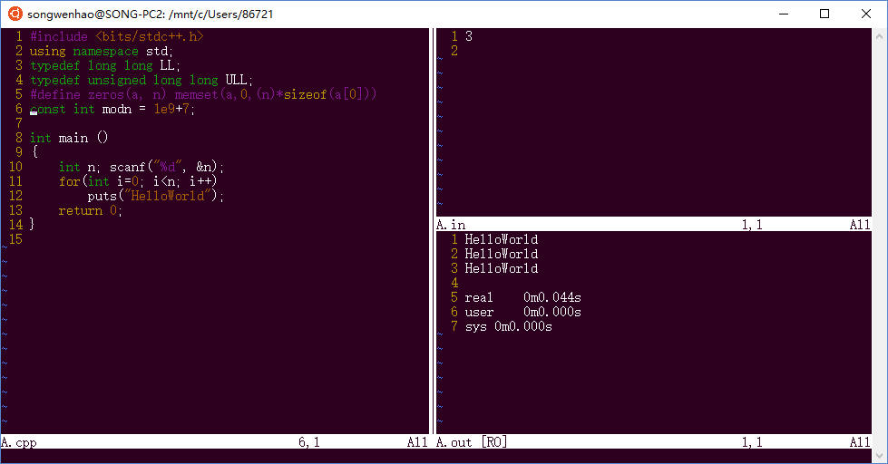

# ACM-ICPC竞赛下的Vim配置：一键进行单文件的编译运行及样例测试 #

## 前言 ##
天下武功，唯快不破。这句话对于争分夺秒的ACM-ICPC赛场也同样的适用。在有限的5个小时时间内，选手需要对题目快速分析、代码实现和提交。在这样的情况下，比赛的每一分一秒都应该使用在题目的阅读和分析，以及代码的实现与调试上。然而，遗憾的是，赛场上有许多时间被浪费在了操作性的工作上，包括：

* 重复的代码include语句的书写
* 调试时样例的反复录入、shell命令的多次键入
* 编辑器与shell窗口的切换
* 提交时反复进行重定向语句的注释与取消注释

这些操作费时费力，且选手不熟悉或在紧要关头（如比赛接近结束）时容易在这类工作上出错，浪费大量时间，影响心情。

为应对这些情况，我配置了vimrc，使得vim下程序的编译、运行、样例输入、显示结果能一键完成，省去了不必要的中间过程，减少了出错的概率，大大加快了调试节奏。我希望的配置实现以下效果：

* 中间过程的自动一键完成，加快反复修改源文件/样例时的测试节奏
* 提交无需对代码进行修改，避免提交时发生诸如忘记注释freopen这类的悲剧，减少犯错概率

## 功能 ##
本vimrc完全面向ACM-ICPC刷题及竞赛现场环境的场景。在多次的尝试与修改之后，最终的Vim配置能自动完成如下功能：

* 编译与运行
* 样例测试与结果显示
* 模板头文件的填充

限于精力限制，我仅针对C++语言进行了配置。对于Java、Python这两种赛场中常见的语言也可按照同样的思路进行配置。

此外，由于赛制要求，该配置文件只能以纸质模板的形式携带，并在开赛后抄写。因此配置文件需要在满足上述功能的基础上做到尽量简短。

## 编译与运行 ##

该配置文件具有自动编译运行的功能。这个过程采用的编译参数如下：

```shell
g++ {filename}.cpp -o{filename} -Wall -std=c++14 -DLOCAL
```

filename指的源文件的文件名，编译出的程序命名为去掉.cpp扩展的名字。LOCAL是自定义的一个宏，方便在代码中进行调试。

源文件的编译对应两种结果。编译成功后Vim会接着进行运行与样例测试工作，并在相应文件中写入运行结果及显示。编译失败或警告(Errors | Warnings)时会调用Vim的quickfix功能指示代码的错误。其中警告出现时，可以按快捷键F10进行后续的运行及测试工作。程序的运行命令如下：

```shell
(time./{filename} <{filename}.in >{filename}.out)2>>{filename}.out
```

该命令会将从当前目录下的filename.in读取输入，将运行结果写入filename.out中，并记录运行时间与文件尾。该过程无需在源文件中加入重定向内容，使得本地保存的代码可以直接提交。

## 样例结果显示 ##

Vim展现多个文件的方法有多种，包括同一个屏幕下分区域展示的window以及使用多个标签页的tab。这里我使用前者对源文件、样例输入、样例输出进行展示。对Vim中的window不熟悉的朋友可以在Vim中输入:help window学习。显示效果如下：



屏幕左侧为代码源文件，右上为样例输入（可编辑），右下为样例输出与运行时间记录（只读）。按Ctrl-W + hjkl可以调整光标分别向四个方向移动到其他窗口中。

## 模板头文件的填充 ##

使用Vim创建新的.cpp文件时，会自动从~/head中读取内容（可在该文件中保存模板头文件），并粘贴进目标文件中。

## 使用方法 ##

视情况选用完整版的vimrc或最小版的vimrc_min，将该vimrc文件加入你的配置中即可完成配置。在Vim下编辑源文件完成后，按下F9开启自动的编译运行与测试工作。

## 注意事项 ##

* 该配置会自动在当前目录下生成可执行程序与.out后缀的输出结果
* 进行自动编译运行测试前需要保证当前窗口为正常的单文件或者三文件窗口的形式。
* 自动编译前会自动保存源文件和样例输入的修改
* 如果运行时程序进入死循环，可以使用Ctrl-C键退出

宋文皓

2018年7月18日
